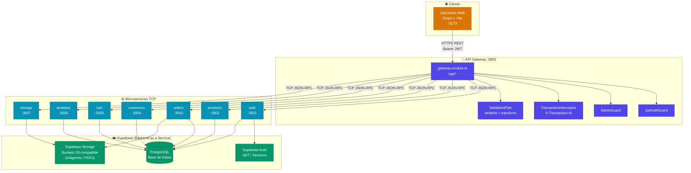

# Arquitectura General del Sistema

## Visión General

El backend está construido sobre **NestJS** con una arquitectura de **microservicios** desacoplados. Un API Gateway actúa como punto de entrada único que enruta las peticiones HTTP al microservicio correspondiente mediante **TCP**.

Todos los microservicios son procesos TCP puros (sin HTTP) y se comunican exclusivamente con el gateway. La capa de persistencia es **Supabase** (PostgreSQL + Auth + Storage S3-compatible).

---

## Diagrama de Arquitectura

---

## Tabla de Servicios

| Servicio | Puerto | Descripción | Guard requerido |
|---|---|---|---|
| **API Gateway** | `3000` | Único punto de entrada HTTP | — |
| **auth** | `3001` | Registro, login, JWT, validate_token | Público / JwtAuthGuard |
| **products** | `3002` | Catálogo de productos y categorías | Público (lectura) / AdminGuard (escritura) |
| **orders** | `3003` | Órdenes, estados, recibos PDF | JwtAuthGuard / AdminGuard |
| **customers** | `3004` | Perfiles y estadísticas de clientes | JwtAuthGuard / AdminGuard |
| **cart** | `3005` | Carrito de compras por usuario | JwtAuthGuard |
| **analytics** | `3006` | Métricas del dashboard admin | AdminGuard |
| **storage** | `3007` | Subida/gestión de archivos a Supabase Storage | AdminGuard |

---

## Patrones de Seguridad

### JwtAuthGuard
1. Extrae `Bearer <token>` del header `Authorization`
2. Envía mensaje TCP `auth.validate_token` al microservicio `auth` (timeout 5s)
3. Si el token es válido → adjunta `user` y `accessToken` al `request`
4. Si falla → lanza `UnauthorizedException (401)`

### AdminGuard
1. Ejecuta `JwtAuthGuard` primero (herencia)
2. Verifica que `request.user.role === 'admin'`
3. Si no es admin → lanza `ForbiddenException (403)`

### TransactionInterceptor
- Se aplica globalmente a todas las peticiones
- Genera un `X-Transaction-Id` único (UUID) y lo expone en los headers de respuesta
- Registra transacciones en logs con timestamp

---

## Variables de Entorno del Gateway

Los hosts de los microservicios son configurables via variables de entorno:

| Variable | Default | Descripción |
|---|---|---|
| `AUTH_SERVICE_HOST` | `localhost` | Host del microservicio Auth |
| `PRODUCTS_SERVICE_HOST` | `localhost` | Host del microservicio Products |
| `ORDERS_SERVICE_HOST` | `localhost` | Host del microservicio Orders |
| `CUSTOMERS_SERVICE_HOST` | `localhost` | Host del microservicio Customers |
| `CART_SERVICE_HOST` | `localhost` | Host del microservicio Cart |
| `ANALYTICS_SERVICE_HOST` | `localhost` | Host del microservicio Analytics |
| `STORAGE_SERVICE_HOST` | `localhost` | Host del microservicio Storage |
| `CORS_ORIGIN` | `http://localhost:5173` | Origen CORS permitido |

> En Docker Compose, estos hosts son los nombres de los contenedores (ej: `auth`, `products`, etc.)
