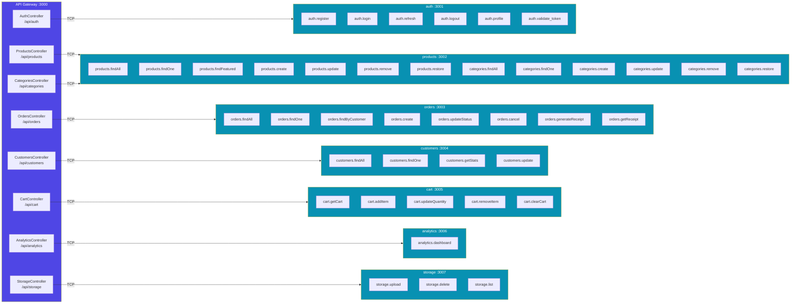

# Comunicación entre Microservicios

## Mecanismo de Transporte

Toda la comunicación interna usa **NestJS TCP (JSON-RPC)**:
- El gateway actúa como **cliente TCP** usando `ClientProxy.send(pattern, payload)` → devuelve `Observable<T>` (RPC con respuesta).
- Los microservicios actúan como **servidores TCP** usando `@MessagePattern(pattern)`.
- No hay Redis, RabbitMQ ni HTTP inter-servicio.

---

## Diagrama Completo de Comunicación

---

## Referencia de Message Patterns

### AUTH_SERVICE — `auth :3001`

| Pattern | Payload | Respuesta | Guard en Gateway |
|---|---|---|---|
| `auth.register` | `{ name, email, password }` | `{ access_token, refresh_token, user }` | Público |
| `auth.login` | `{ email, password }` | `{ access_token, refresh_token, user }` | Público |
| `auth.refresh` | `{ refresh_token }` | `{ access_token, refresh_token }` | Público |
| `auth.logout` | `{ accessToken }` | `{ message }` | JwtAuthGuard |
| `auth.profile` | `{ userId }` | `Customer` | JwtAuthGuard |
| `auth.validate_token` | `{ token }` | `{ id, email, role }` | Usado internamente por Guards |

### PRODUCTS_SERVICE — `products :3002`

| Pattern | Payload | Respuesta | Guard |
|---|---|---|---|
| `products.findAll` | `QueryProductDto` | `PaginatedResult<Product>` | Público |
| `products.findOne` | `{ id: string }` | `Product` | Público |
| `products.findFeatured` | `{}` | `Product[]` | Público |
| `products.create` | `CreateProductDto` | `Product` | AdminGuard |
| `products.update` | `{ id, dto: UpdateProductDto }` | `Product` | AdminGuard |
| `products.remove` | `{ id: string }` | `{ message }` | AdminGuard |
| `products.restore` | `{ id: string }` | `Product` | AdminGuard |
| `categories.findAll` | `{}` | `Category[]` | Público |
| `categories.findOne` | `{ id: string }` | `Category` | Público |
| `categories.create` | `CreateCategoryDto` | `Category` | AdminGuard |
| `categories.update` | `{ id, dto: UpdateCategoryDto }` | `Category` | AdminGuard |
| `categories.remove` | `{ id: string }` | `{ message }` | AdminGuard |
| `categories.restore` | `{ id: string }` | `Category` | AdminGuard |

### ORDERS_SERVICE — `orders :3003`

| Pattern | Payload | Respuesta | Guard |
|---|---|---|---|
| `orders.findAll` | `QueryOrderDto` | `PaginatedResult<Order>` | AdminGuard |
| `orders.findOne` | `{ id: string }` | `Order` | JwtAuthGuard |
| `orders.findByCustomer` | `{ customerId, query: PaginationDto }` | `PaginatedResult<Order>` | JwtAuthGuard |
| `orders.create` | `{ userId, dto: CreateOrderDto }` | `Order` | JwtAuthGuard |
| `orders.updateStatus` | `{ id, dto: UpdateOrderStatusDto }` | `Order` | AdminGuard |
| `orders.cancel` | `{ id: string }` | `Order` | JwtAuthGuard |
| `orders.generateReceipt` | `{ id: string }` | `{ receipt_url }` | AdminGuard |
| `orders.getReceipt` | `{ id: string }` | `{ receipt_url }` | JwtAuthGuard |

### CUSTOMERS_SERVICE — `customers :3004`

| Pattern | Payload | Respuesta | Guard |
|---|---|---|---|
| `customers.findAll` | `QueryCustomerDto` | `PaginatedResult<Customer>` | AdminGuard |
| `customers.findOne` | `{ id: string }` | `Customer` | JwtAuthGuard |
| `customers.getStats` | `{ id: string }` | `CustomerStats` | JwtAuthGuard |
| `customers.update` | `{ id, dto: { name?, phone?, avatar? } }` | `Customer` | JwtAuthGuard |

### CART_SERVICE — `cart :3005`

| Pattern | Payload | Respuesta | Guard |
|---|---|---|---|
| `cart.getCart` | `{ customerId: string }` | `{ items, total, itemCount }` | JwtAuthGuard |
| `cart.addItem` | `{ customerId, dto: AddToCartDto }` | `CartItem` | JwtAuthGuard |
| `cart.updateQuantity` | `{ customerId, itemId, quantity }` | `CartItem` | JwtAuthGuard |
| `cart.removeItem` | `{ customerId, itemId }` | `{ message }` | JwtAuthGuard |
| `cart.clearCart` | `{ customerId: string }` | `{ message }` | JwtAuthGuard |

### ANALYTICS_SERVICE — `analytics :3006`

| Pattern | Payload | Respuesta | Guard |
|---|---|---|---|
| `analytics.dashboard` | `{}` | `DashboardStats` | AdminGuard |

### STORAGE_SERVICE — `storage :3007`

| Pattern | Payload | Respuesta | Guard |
|---|---|---|---|
| `storage.upload` | `{ file: { buffer: base64, originalname, mimetype }, folder }` | `{ url, path }` | AdminGuard |
| `storage.delete` | `{ path: string }` | `{ message }` | AdminGuard |
| `storage.list` | `{ folder: string }` | `FileObject[]` | AdminGuard |

> **Nota sobre Storage**: El `Buffer` del archivo se convierte a **base64** antes de enviarse por TCP porque JSON no soporta datos binarios directamente. El microservicio storage lo decodifica de vuelta a `Buffer` antes de subir a Supabase.

---

## Diagrama Visual Interactivo (Excalidraw)

Para visualizar la arquitectura de forma interactiva:

1. Abre el archivo [`architecture.excalidraw`](./architecture.excalidraw) con la extensión **Excalidraw** de VS Code, o
2. Ve a [excalidraw.com](https://excalidraw.com) → **Open** → selecciona el archivo `architecture.excalidraw`

El diagrama incluye:
- Layout visual de todos los servicios con colores por capa
- Flechas TCP etiquetadas con puertos
- Agrupación por dominio funcional
- Conexiones a Supabase (DB, Auth, Storage)
