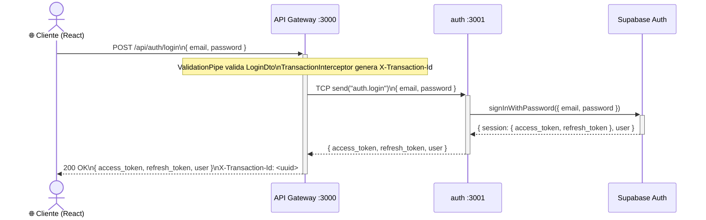
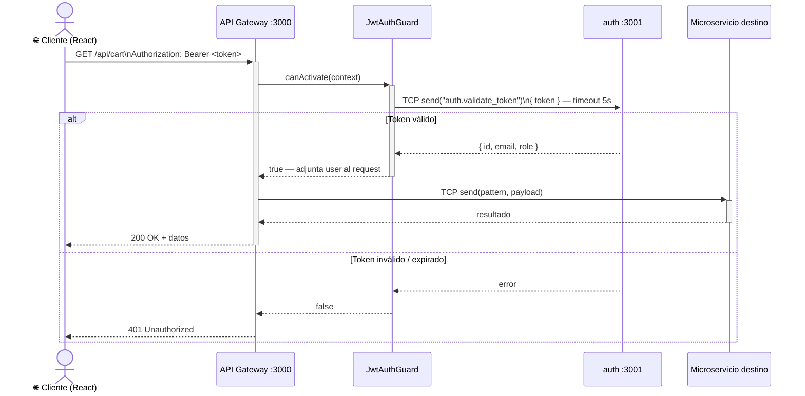
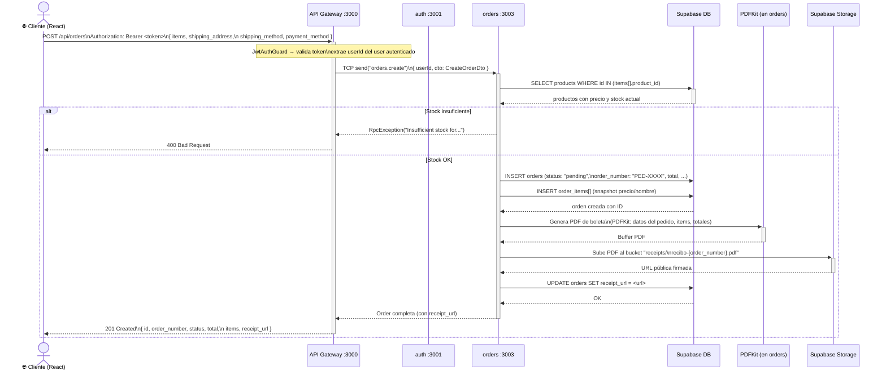
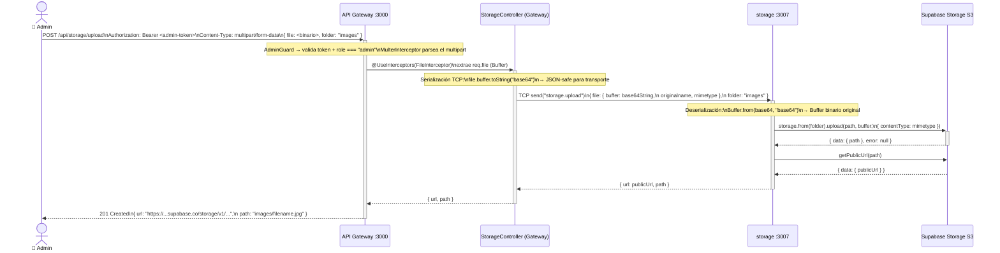
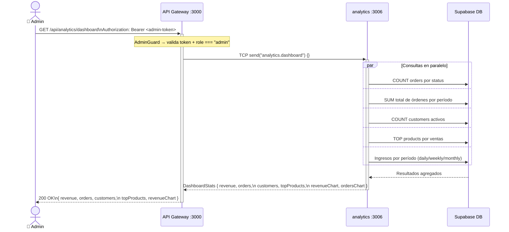

# Diagramas de Secuencia UML

Estos diagramas muestran el flujo completo de las operaciones más importantes del sistema, desde la petición HTTP del cliente hasta la respuesta final, pasando por todos los microservicios involucrados.

---

## 1. Flujo de Autenticación (Login)



---

## 2. Flujo de Validación de Token (en cada request autenticado)



---

## 3. Flujo de Creación de Orden (Checkout)

Este es el flujo más complejo: involucra validación de stock en products, creación en Supabase, generación de PDF con PDFKit y subida a Supabase Storage.



---

## 4. Flujo de Carrito de Compras (Agregar Item)

```mermaid
sequenceDiagram
    actor Cliente as 🌐 Cliente (React)
    participant GW as API Gateway :3000
    participant CART as cart :3005
    participant DB as Supabase DB

    Cliente->>+GW: POST /api/cart/items\nAuthorization: Bearer <token>\n{ product_id, quantity }

    note over GW: JwtAuthGuard → extrae customerId del token

    GW->>+CART: TCP send("cart.addItem")\n{ customerId, dto: { product_id, quantity } }

    CART->>+DB: SELECT cart_items\nWHERE customer_id = X\nAND product_id = Y\nAND deleted_at IS NULL

    alt Item ya existe en el carrito
        DB-->>CART: CartItem existente
        CART->>DB: UPDATE cart_items\nSET quantity = existing + new
        DB-->>-CART: CartItem actualizado
    else Item nuevo
        CART->>DB: INSERT cart_items\n{ customer_id, product_id, quantity }
        DB-->>-CART: CartItem creado
    end

    CART-->>-GW: CartItem (con datos del producto)
    GW-->>-Cliente: 201 Created\n{ id, product_id, quantity, product: {...} }
```

---

## 5. Flujo de Subida de Imagen (Storage)

Este flujo incluye la serialización especial del `Buffer` binario a **base64** para el transporte TCP.



---

## 6. Flujo de Dashboard de Analytics


