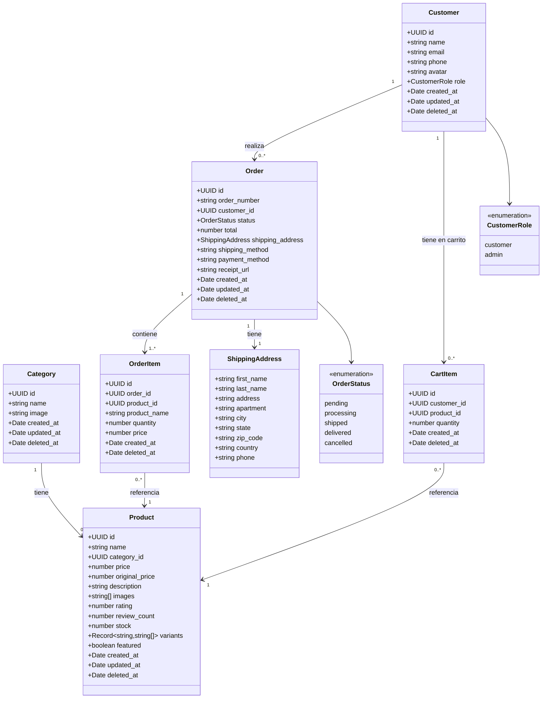
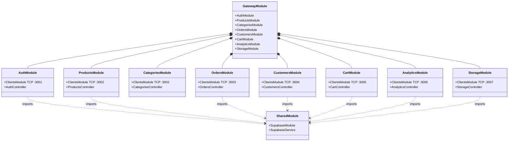

# Diagrama UML de Clases

## Entidades del Dominio

```mermaid
classDiagram
    class Category {
        +UUID id
        +string name
        +string image
        +Date created_at
        +Date updated_at
        +Date deleted_at
    }

    class Product {
        +UUID id
        +string name
        +UUID category_id
        +number price
        +number original_price
        +string description
        +string[] images
        +number rating
        +number review_count
        +number stock
        +Record~string,string[]~ variants
        +boolean featured
        +Date created_at
        +Date updated_at
        +Date deleted_at
    }

    class Customer {
        +UUID id
        +string name
        +string email
        +string phone
        +string avatar
        +CustomerRole role
        +Date created_at
        +Date updated_at
        +Date deleted_at
    }

    class Order {
        +UUID id
        +string order_number
        +UUID customer_id
        +OrderStatus status
        +number total
        +ShippingAddress shipping_address
        +string shipping_method
        +string payment_method
        +string receipt_url
        +Date created_at
        +Date updated_at
        +Date deleted_at
    }

    class OrderItem {
        +UUID id
        +UUID order_id
        +UUID product_id
        +string product_name
        +number quantity
        +number price
        +Date created_at
        +Date deleted_at
    }

    class CartItem {
        +UUID id
        +UUID customer_id
        +UUID product_id
        +number quantity
        +Date created_at
        +Date deleted_at
    }

    class ShippingAddress {
        +string first_name
        +string last_name
        +string address
        +string apartment
        +string city
        +string state
        +string zip_code
        +string country
        +string phone
    }

    class CustomerRole {
        <<enumeration>>
        customer
        admin
    }

    class OrderStatus {
        <<enumeration>>
        pending
        processing
        shipped
        delivered
        cancelled
    }

    Category "1" --> "0..*" Product : tiene
    Customer "1" --> "0..*" Order : realiza
    Customer "1" --> "0..*" CartItem : tiene en carrito
    Order "1" --> "1..*" OrderItem : contiene
    Order "1" --> "1" ShippingAddress : tiene
    OrderItem "0..*" --> "1" Product : referencia
    CartItem "0..*" --> "1" Product : referencia
    Customer --> CustomerRole
    Order --> OrderStatus
```

---

## DTOs — Capa de Transferencia de Datos

```mermaid
classDiagram
    class PaginationDto {
        +number page
        +number limit
    }

    class PaginatedResult~T~ {
        <<interface>>
        +T[] data
        +number total
        +number page
        +number limit
        +number totalPages
    }

    class RegisterDto {
        +string name
        +string email
        +string password
    }

    class LoginDto {
        +string email
        +string password
    }

    class CreateCategoryDto {
        +string name
        +string image
    }

    class UpdateCategoryDto {
        +string name
        +string image
    }

    class CreateProductDto {
        +string name
        +string category_id
        +number price
        +number original_price
        +string description
        +string[] images
        +number stock
        +Record~string,string[]~ variants
        +boolean featured
    }

    class UpdateProductDto {
        +string name
        +string category_id
        +number price
        +number original_price
        +string description
        +string[] images
        +number stock
        +Record~string,string[]~ variants
        +boolean featured
    }

    class QueryProductDto {
        +string category_id
        +string search
        +number min_price
        +number max_price
        +number min_rating
        +boolean featured
        +ProductSort sort
    }

    class ProductSort {
        <<enumeration>>
        price_asc
        price_desc
        rating
        newest
        name
    }

    class OrderItemDto {
        +string product_id
        +number quantity
    }

    class ShippingAddressDto {
        +string first_name
        +string last_name
        +string address
        +string apartment
        +string city
        +string state
        +string zip_code
        +string country
        +string phone
    }

    class CreateOrderDto {
        +OrderItemDto[] items
        +ShippingAddressDto shipping_address
        +string shipping_method
        +string payment_method
    }

    class UpdateOrderStatusDto {
        +OrderStatus status
    }

    class QueryOrderDto {
        +string status
    }

    class AddToCartDto {
        +string product_id
        +number quantity
    }

    class QueryCustomerDto {
        +string search
    }

    UpdateCategoryDto --|> CreateCategoryDto : PartialType
    UpdateProductDto  --|> CreateProductDto  : PartialType
    QueryProductDto   --|> PaginationDto     : extends
    QueryOrderDto     --|> PaginationDto     : extends
    QueryCustomerDto  --|> PaginationDto     : extends

    CreateOrderDto "1" *-- "1..*" OrderItemDto       : contiene
    CreateOrderDto "1" *-- "1"   ShippingAddressDto  : contiene
```

---

## Módulos NestJS

```mermaid
classDiagram
    class GatewayModule {
        +AuthModule
        +ProductsModule
        +CategoriesModule
        +OrdersModule
        +CustomersModule
        +CartModule
        +AnalyticsModule
        +StorageModule
    }

    class AuthModule {
        +ClientsModule TCP :3001
        +AuthController
    }

    class ProductsModule {
        +ClientsModule TCP :3002
        +ProductsController
    }

    class CategoriesModule {
        +ClientsModule TCP :3002
        +CategoriesController
    }

    class OrdersModule {
        +ClientsModule TCP :3003
        +OrdersController
    }

    class CustomersModule {
        +ClientsModule TCP :3004
        +CustomersController
    }

    class CartModule {
        +ClientsModule TCP :3005
        +CartController
    }

    class AnalyticsModule {
        +ClientsModule TCP :3006
        +AnalyticsController
    }

    class StorageModule {
        +ClientsModule TCP :3007
        +StorageController
    }

    class SharedModule {
        +SupabaseModule
        +SupabaseService
    }

    GatewayModule *-- AuthModule
    GatewayModule *-- ProductsModule
    GatewayModule *-- CategoriesModule
    GatewayModule *-- OrdersModule
    GatewayModule *-- CustomersModule
    GatewayModule *-- CartModule
    GatewayModule *-- AnalyticsModule
    GatewayModule *-- StorageModule

    AuthModule      ..> SharedModule : imports
    ProductsModule  ..> SharedModule : imports
    OrdersModule    ..> SharedModule : imports
    CustomersModule ..> SharedModule : imports
    CartModule      ..> SharedModule : imports
    AnalyticsModule ..> SharedModule : imports
    StorageModule   ..> SharedModule : imports
```
