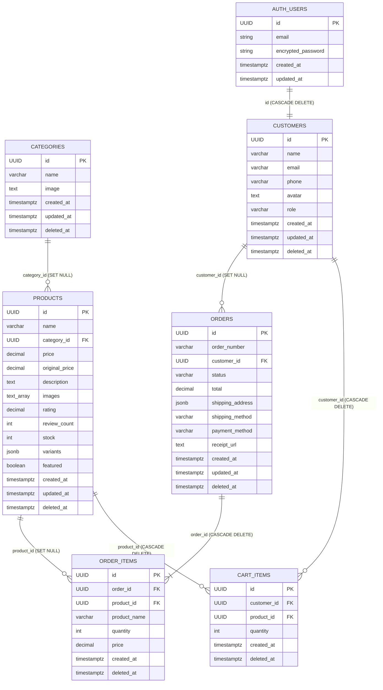

# Diagrama de Base de Datos

La base de datos es **PostgreSQL** gestionada por **Supabase**. Incluye Row Level Security (RLS) y soft delete en todas las tablas.

---

## Diagrama Entidad-Relación (ER)

---

## Descripción de Tablas

### `auth.users` (Supabase Managed)
Tabla gestionada internamente por Supabase Auth. No se modifica directamente. Es el origen de identidad de todos los usuarios.

### `public.categories`
| Columna | Tipo | Descripción |
|---|---|---|
| `id` | `UUID` | PK, `gen_random_uuid()` |
| `name` | `VARCHAR(255)` | Nombre de la categoría |
| `image` | `TEXT` | URL de imagen representativa |
| `created_at` | `TIMESTAMPTZ` | `now()` |
| `updated_at` | `TIMESTAMPTZ` | Auto-trigger al modificar |
| `deleted_at` | `TIMESTAMPTZ` | Soft delete (`NULL` = activo) |

### `public.products`
| Columna | Tipo | Descripción |
|---|---|---|
| `id` | `UUID` | PK |
| `name` | `VARCHAR(255)` | Nombre del producto |
| `category_id` | `UUID` | FK → `categories(id)` ON DELETE SET NULL |
| `price` | `DECIMAL(10,2)` | Precio actual |
| `original_price` | `DECIMAL(10,2)` | Precio original (para mostrar descuento) |
| `description` | `TEXT` | Descripción larga |
| `images` | `TEXT[]` | Array de URLs de imágenes |
| `rating` | `DECIMAL(2,1)` | Rating promedio (0.0 – 5.0) |
| `review_count` | `INTEGER` | Número de reseñas |
| `stock` | `INTEGER` | Stock disponible |
| `variants` | `JSONB` | Variantes: `{"color":["Negro","Blanco"],"size":["S","M","L"]}` |
| `featured` | `BOOLEAN` | Producto destacado en homepage |
| `deleted_at` | `TIMESTAMPTZ` | Soft delete |

### `public.customers`
| Columna | Tipo | Descripción |
|---|---|---|
| `id` | `UUID` | PK = `auth.users.id` (no autogenerado) |
| `name` | `VARCHAR(255)` | Nombre completo |
| `email` | `VARCHAR(255)` | Email (sincronizado con auth.users) |
| `phone` | `VARCHAR(50)` | Teléfono opcional |
| `avatar` | `TEXT` | URL de avatar |
| `role` | `VARCHAR(20)` | `'customer'` o `'admin'` |
| `deleted_at` | `TIMESTAMPTZ` | Soft delete |

### `public.orders`
| Columna | Tipo | Descripción |
|---|---|---|
| `id` | `UUID` | PK |
| `order_number` | `VARCHAR(50)` | UNIQUE, formato `PED-XXXX` |
| `customer_id` | `UUID` | FK → `customers(id)` ON DELETE SET NULL |
| `status` | `VARCHAR(20)` | `pending` / `processing` / `shipped` / `delivered` / `cancelled` |
| `total` | `DECIMAL(10,2)` | Total de la orden |
| `shipping_address` | `JSONB` | Dirección completa de envío |
| `shipping_method` | `VARCHAR(50)` | `standard` / `express` / etc. |
| `payment_method` | `VARCHAR(50)` | `card` / `paypal` / etc. |
| `receipt_url` | `TEXT` | URL firmada del PDF de boleta en Supabase Storage |
| `deleted_at` | `TIMESTAMPTZ` | Soft delete |

### `public.order_items`
| Columna | Tipo | Descripción |
|---|---|---|
| `id` | `UUID` | PK |
| `order_id` | `UUID` | FK → `orders(id)` ON DELETE CASCADE |
| `product_id` | `UUID` | FK → `products(id)` ON DELETE SET NULL |
| `product_name` | `VARCHAR(255)` | Snapshot del nombre (inmutable al editar el producto) |
| `quantity` | `INTEGER` | Cantidad ordenada |
| `price` | `DECIMAL(10,2)` | Snapshot del precio (inmutable al editar el producto) |
| `deleted_at` | `TIMESTAMPTZ` | Soft delete |

### `public.cart_items`
| Columna | Tipo | Descripción |
|---|---|---|
| `id` | `UUID` | PK |
| `customer_id` | `UUID` | FK → `customers(id)` ON DELETE CASCADE |
| `product_id` | `UUID` | FK → `products(id)` ON DELETE CASCADE |
| `quantity` | `INTEGER` | Cantidad en el carrito |
| `deleted_at` | `TIMESTAMPTZ` | Soft delete |
| — | UNIQUE | `(customer_id, product_id)` — un producto único por carrito |

---

## Índices de Rendimiento

| Índice | Tabla | Columnas | Tipo | Descripción |
|---|---|---|---|---|
| `idx_products_category` | products | `category_id` | BTREE | Filtros por categoría |
| `idx_products_featured` | products | `featured` | BTREE parcial (WHERE featured=true) | Productos destacados |
| `idx_products_price` | products | `price` | BTREE | Ordenar/filtrar por precio |
| `idx_products_rating` | products | `rating` | BTREE | Ordenar por rating |
| `idx_products_name` | products | `name` | GIN trigram | Búsqueda full-text con `ilike` |
| `idx_products_active` | products | — | parcial (WHERE deleted_at IS NULL) | Excluir soft deleted |
| `idx_orders_customer` | orders | `customer_id` | BTREE | Órdenes por cliente |
| `idx_orders_status` | orders | `status` | BTREE | Filtros por estado |
| `idx_orders_created` | orders | `created_at` | BTREE | Ordenar por fecha |
| `idx_order_items_order` | order_items | `order_id` | BTREE | Items de una orden |
| `idx_cart_items_customer` | cart_items | `customer_id` | BTREE | Carrito por cliente |
| `idx_customers_role` | customers | `role` | BTREE | Filtrar admins |

---

## Políticas de Row Level Security (RLS)

| Tabla | Política | Descripción |
|---|---|---|
| `categories` | Lectura pública | Cualquiera puede leer |
| `categories` | Escritura autenticada | Solo usuarios autenticados pueden escribir |
| `products` | Lectura pública con soft delete | `WHERE deleted_at IS NULL` |
| `products` | Escritura autenticada | Solo autenticados |
| `customers` | Solo propio registro | `USING (auth.uid() = id)` |
| `orders` | Solo del propio usuario | `USING (auth.uid() = customer_id)` |
| `order_items` | Solo de las órdenes del usuario | Join con orders |
| `cart_items` | Solo del propio usuario | `USING (auth.uid() = customer_id)` |

> **Nota**: El backend usa la clave `SUPABASE_SERVICE_ROLE_KEY` que **bypasea el RLS** completamente, permitiendo que los microservicios realicen operaciones de admin sin restricciones.

---

## Triggers

Todas las tablas principales tienen un trigger `set_updated_at` que actualiza automáticamente la columna `updated_at` usando la función `trigger_set_timestamp()` en cada `UPDATE`.
